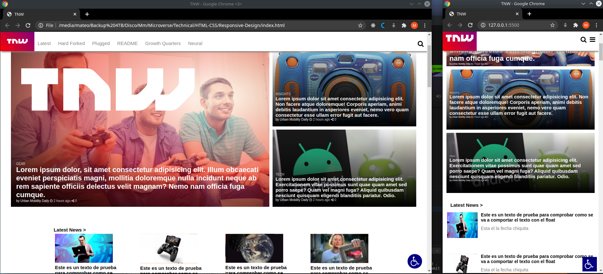

# Responsive Web Design

> The purporse of this project was to crate a responsive clone of the TNW page.

At the breakpoint of 900px the website changes the layout to fit all the content on a smaller screen. All of the responsive components were achived by using jus css, no additional libraries or frameworks were used.

## Built With

- HTML / CSS,
- Media queries
- VSCode

## Live Demo

[Live Demo Link](https://raw.githack.com/mateomh/Responsive-Design/tnw-page/index.html)

### Usage
The breakpoint is set to 900px in the media query

## Authors

👤 **Mateo mojica**

- Github: [@mateomh](https://github.com/mateomh)
- Twitter: [@mateo_m_h](https://twitter.com/mateo_m_h)
- Linkedin: [linkedin](https://linkedin.com/mateo_mojica_hernandez)

👤 **Jurgen Clausen**

- Github: [@jurgen1c](https://github.com/jurgen1c)
- LinkenIn:[LinkenIn](https://www.linkedin.com/in/jurgen-clausen-2740061a9/)

## 🤝 Contributing

Contributions, issues and feature requests are welcome!

Feel free to check the [issues page](issues/).

## Show your support

Give a ⭐️ if you like this project!

## Acknowledgments

- The Next Web
- Microverse
- Odin Project

## 📝 License

This project is [MIT](lic.url) licensed.
